# CTX V3 SCHEMA - Context Window Layout

**Version:** 3.0.0
**Date:** November 24, 2025
**Purpose:** Define context window structure for ML training
**Status:** Production Ready

---

## 1. Overview

The CTX V3 Schema defines the structure of the 30-50 bar context window used for ML training. Each context window contains:
- Historical bar features (30-50 bars)
- Current bar features
- Target label (long/short/skip)

---

## 2. Context Window Structure

### 2.1 Complete Schema Diagram


### 2.2 Feature Categories


---

## 3. Detailed Field Specification

### 3.1 Per-Bar Features Table

| Category | Field | Type | Range | Description |
|----------|-------|------|-------|-------------|
| **Price** | `open` | float | > 0 | Bar open price |
| | `high` | float | > 0 | Bar high price |
| | `low` | float | > 0 | Bar low price |
| | `close` | float | > 0 | Bar close price |
| **Volume** | `volume` | int | >= 0 | Total volume |
| | `delta` | int | any | buy_vol - sell_vol |
| | `buy_vol` | int | >= 0 | Volume at ask |
| | `sell_vol` | int | >= 0 | Volume at bid |
| **External SMC** | `ext_bos` | bool | T/F | External BOS detected |
| | `ext_choch` | bool | T/F | External CHoCH detected |
| | `ext_choch_down` | bool | T/F | CHoCH from down |
| | `ext_choch_up` | bool | T/F | CHoCH from up |
| **Internal SMC** | `int_bos` | bool | T/F | Internal BOS |
| | `int_choch` | bool | T/F | Internal CHoCH |
| | `sweep_prev_high` | bool | T/F | Swept previous high |
| | `sweep_prev_low` | bool | T/F | Swept previous low |
| **Direction** | `ext_dir` | int | -1,0,1 | External direction |
| | `int_dir` | int | -1,0,1 | Internal direction |
| **FVG** | `fvg_up` | bool | T/F | Bullish FVG exists |
| | `fvg_down` | bool | T/F | Bearish FVG exists |
| | `fvg_retest` | bool | T/F | FVG was retested |
| **MGann** | `mgann_leg_index` | int | 1-10 | Current leg index |
| | `wave_strength` | int | 0-100 | Wave strength score |
| | `pb_wave_strength_ok` | bool | T/F | PB strength confirmed |

---

## 4. Context Window Layout

### 4.1 Window Structure


### 4.2 Feature Vector Construction

```mermaid
flowchart TD
    subgraph Construction["Feature Vector Construction"]
        direction TB

        INPUT[Context Window<br/>30-50 bars × 25 features]

        FLATTEN[Flatten: Sequential Features]

        CURRENT[Current Bar Features<br/>25 features]

        META[Meta Features<br/>session, time, etc.]

        CONCAT[Concatenate All]

        OUTPUT[Final Feature Vector<br/>~800-1300 dimensions]
    end

    INPUT --> FLATTEN --> CONCAT
    CURRENT --> CONCAT
    META --> CONCAT
    CONCAT --> OUTPUT
```



---

## 5. Target/Label Schema

### 5.1 Label Format


### 5.2 Label Distribution Target


---

## 6. Data Flow

### 6.1 Context Generation Pipeline


---

## 7. JSON Schema Example

### 7.1 Single Training Sample

```json
{
    "context_bars": [
        {
            "bar_index": 950,
            "open": 2050.0,
            "high": 2052.5,
            "low": 2049.0,
            "close": 2051.5,
            "volume": 1000,
            "delta": 150,
            "ext_dir": 1,
            "int_dir": 1,
            "ext_bos": false,
            "ext_choch": false,
            "ext_choch_down": false,
            "fvg_up": false,
            "fvg_down": false,
            "fvg_retest": false,
            "mgann_leg_index": 1,
            "wave_strength": 65,
            "pb_wave_strength_ok": false
        }
        // ... 29-49 more bars
    ],
    "current_bar": {
        "bar_index": 1000,
        "open": 2055.0,
        "high": 2058.0,
        "low": 2054.0,
        "close": 2057.5,
        "volume": 1500,
        "delta": 400,
        "ext_dir": 1,
        "ext_choch_down": true,
        "fvg_up": true,
        "fvg_retest": true,
        "mgann_leg_index": 2,
        "pb_wave_strength_ok": true
    },
    "label": "long",
    "label_confidence": 1.0,
    "conditions_met": [
        "ext_choch_down",
        "fvg_up",
        "fvg_retest",
        "ext_dir_up",
        "mgann_leg_early",
        "pb_wave_ok"
    ],
    "conditions_failed": []
}
```

---

## 8. Normalization

### 8.1 Feature Normalization


---

## 9. Version History

| Version | Date | Changes |
|---------|------|---------|
| 3.0.0 | 2025-11-24 | CTX V3 Schema with Mermaid diagrams |

---

**Status:** Production Ready
**Related:** [ARCHITECTURE_V3.md](../ARCHITECTURE_V3.md), [LABEL_RULES.md](LABEL_RULES.md)
