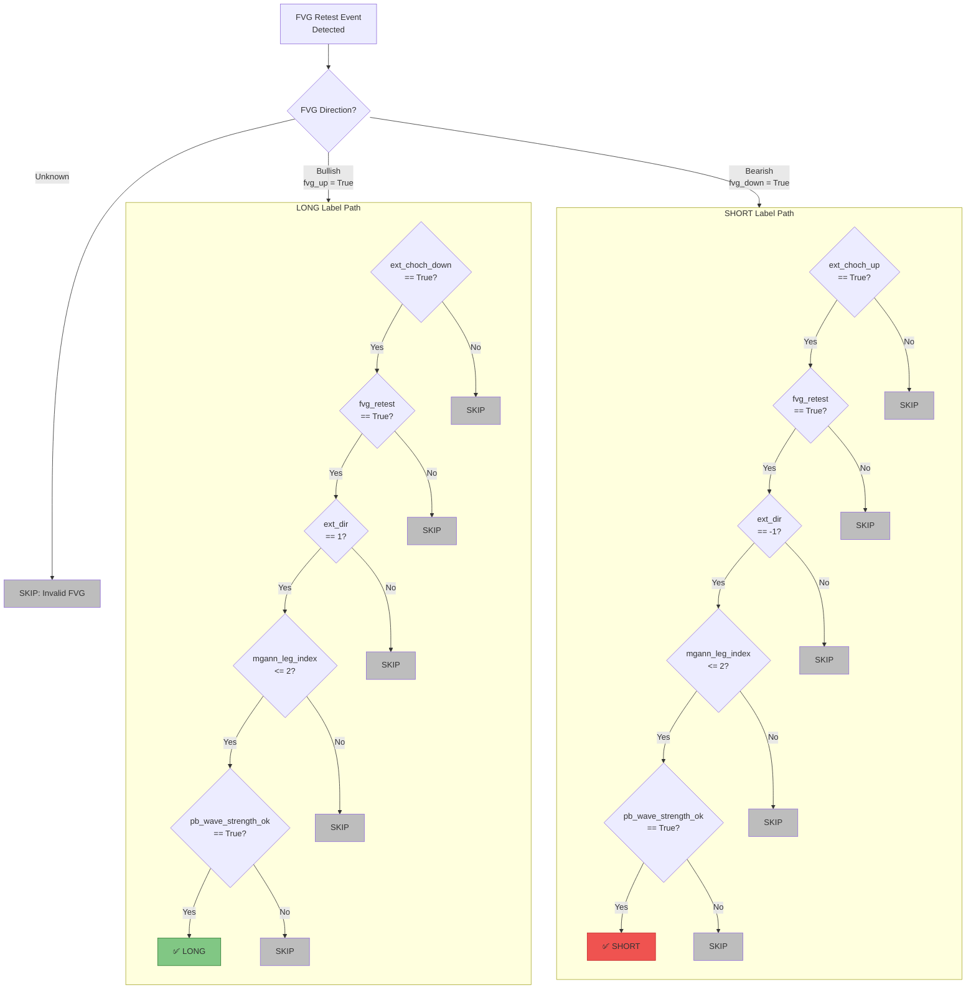
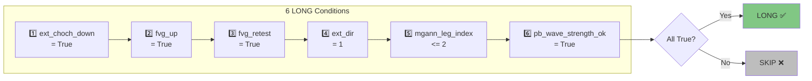
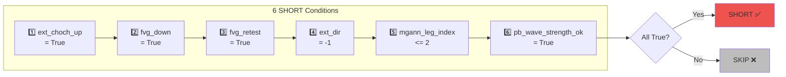
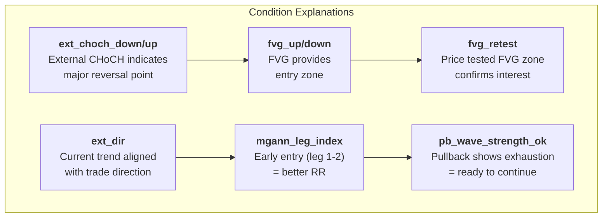
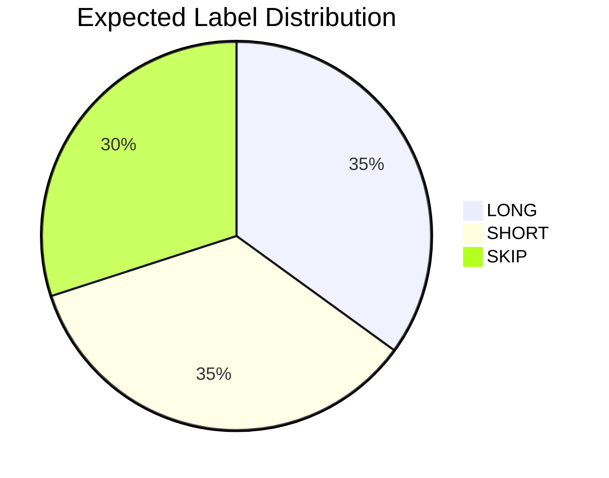
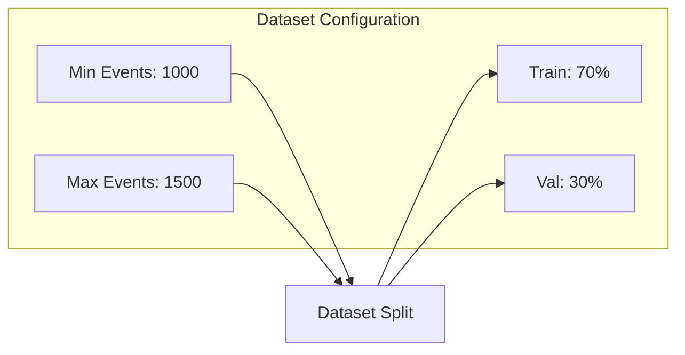
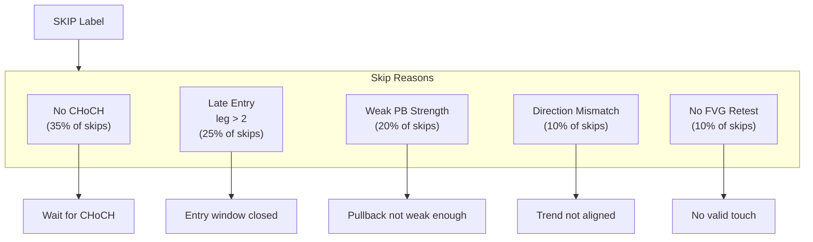
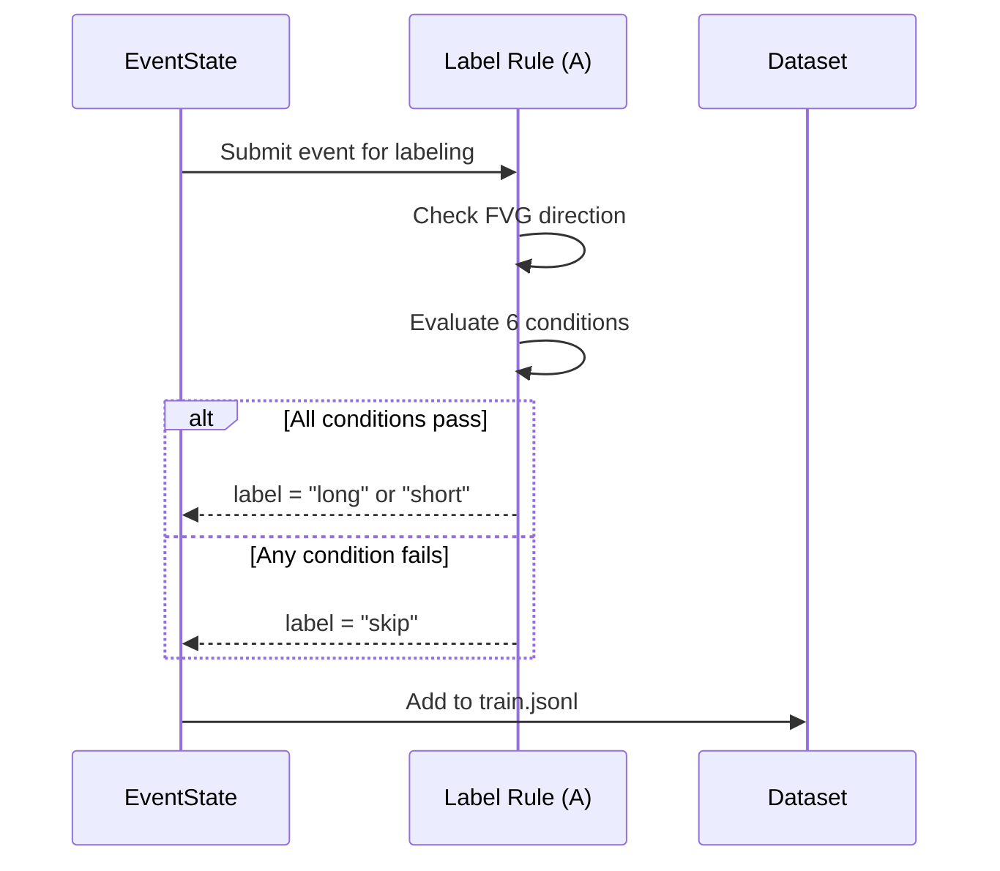
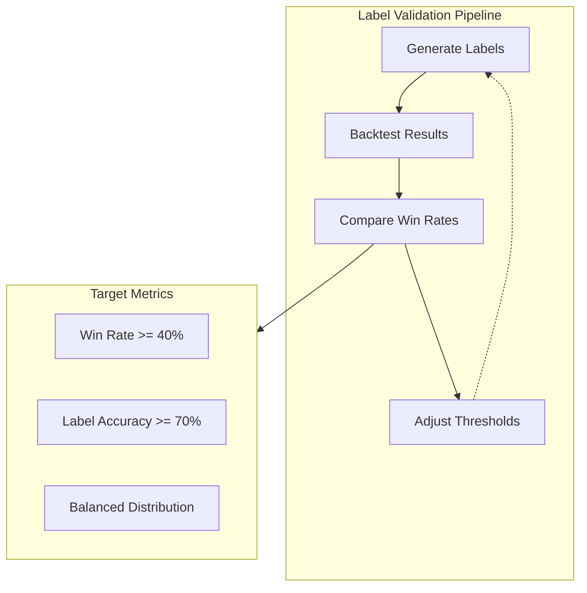

# LAYER 2: LABEL RULES V1

**Version:** 1.0.0
**Date:** November 24, 2025
**Layer:** 2 → 3 (Processor to ML Pipeline)
**Status:** Production Ready

---

## 1. Overview

Label Rules V1 implements deterministic labeling for ML training:
- **LONG**: All 6 bullish conditions satisfied
- **SHORT**: All 6 bearish conditions satisfied
- **SKIP**: Any condition fails

---

## 2. Label Rule (A) - Complete Flow

### 2.1 Master Decision Diagram



---

## 3. Conditions Detail

### 3.1 LONG Conditions



### 3.2 SHORT Conditions



---

## 4. Condition Explanations

### 4.1 Condition Matrix



### 4.2 Field Sources

| Condition | Source Module | Field Type |
|-----------|---------------|------------|
| ext_choch_down/up | Module #03 Structure Context | bool |
| fvg_up/down | Module #02 FVG Quality | bool |
| fvg_retest | Module #12 FVG Retest | bool |
| ext_dir | Module #03 Structure Context | int |
| mgann_leg_index | Module #14 MGann Swing | int |
| pb_wave_strength_ok | Module #14 MGann Swing | bool |

---

## 5. Label Distribution

### 5.1 Target Distribution



### 5.2 Dataset Requirements



---

## 6. Skip Reasons Analysis

### 6.1 Common Skip Reasons



---

## 7. Implementation

### 7.1 Python Implementation

```python
def apply_label_rule_a(event: dict) -> dict:
    """
    Apply Label Rule (A) to determine signal label.

    Returns:
        dict: {label, confidence, reason, conditions_met, conditions_failed}
    """
    fvg_type = event.get("fvg_type", "unknown")

    if fvg_type == "bullish" or event.get("fvg_up", False):
        return apply_label_rule_long(event)
    elif fvg_type == "bearish" or event.get("fvg_down", False):
        return apply_label_rule_short(event)
    else:
        return {
            "label": "skip",
            "confidence": 0.0,
            "reason": "No valid FVG detected"
        }
```

### 7.2 Labeling Process Flow



---

## 8. Quality Metrics

### 8.1 Label Quality Validation



### 8.2 Expected Results

| Label | Win Rate Target | Distribution |
|-------|-----------------|--------------|
| LONG | >= 40% | ~35% |
| SHORT | >= 40% | ~35% |
| SKIP | N/A (filtered) | ~30% |

---

## 9. Version History

| Version | Date | Changes |
|---------|------|---------|
| 1.0.0 | 2025-11-24 | Initial Label Rules V1 with Mermaid diagrams |

---

**Status:** Production Ready
**Related:** [LABEL_RULES.md](LABEL_RULES.md), [ARCHITECTURE_V3.md](../ARCHITECTURE_V3.md)
