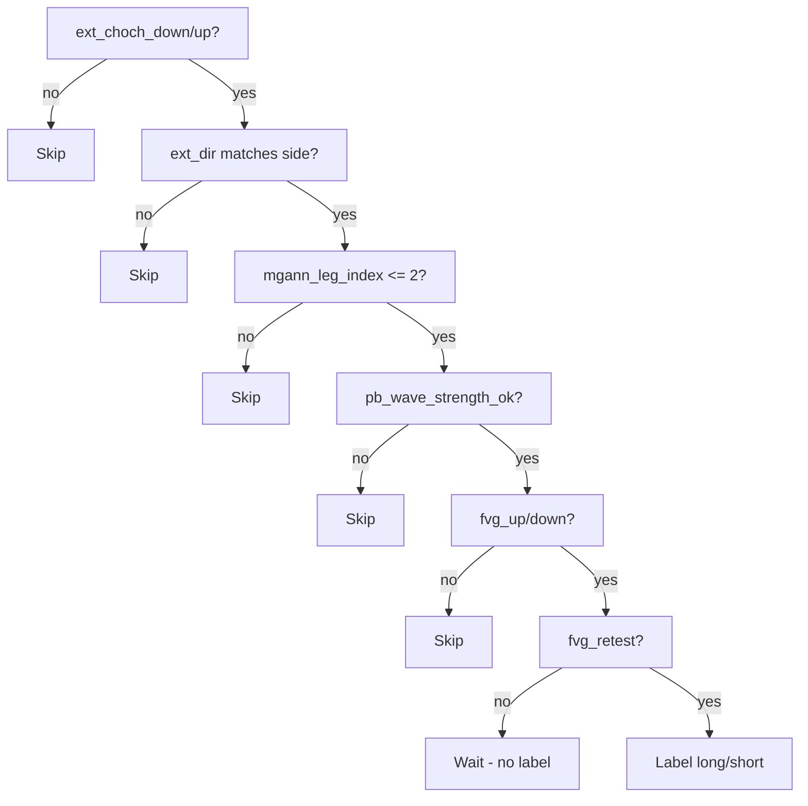

# Layer 2 — Label Rules v1 (Unified)

Single rule set (Case A + Case B merged) for labeling events from the exporter. Outputs `long`, `short`, or `skip`.

## Rules
**Long:**
- `ext_choch_down = true`
- `fvg_up = true`
- `fvg_retest = true`
- `ext_dir = 1`
- `mgann_leg_index <= 2`
- `pb_wave_strength_ok = true`
- → `label = "long"`

**Short:**
- `ext_choch_up = true`
- `fvg_down = true`
- `fvg_retest = true`
- `ext_dir = -1`
- `mgann_leg_index <= 2`
- `pb_wave_strength_ok = true`
- → `label = "short"`

**Else:** `label = "skip"`.

## Flowchart (Mermaid)


## Field mapping (exporter → labeler)
| Exporter field | Use |
|----------------|-----|
| `ext_choch_down` / `ext_choch_up` | Structure reclaim trigger |
| `ext_dir` | Must align with side (1 for long, -1 for short) |
| `fvg_up` / `fvg_down` | Directional FVG gate |
| `fvg_retest` | Timing confirmation |
| `mgann_leg_index` | Eligibility (≤2) |
| `pb_wave_strength_ok` | Quality gate |
| `mgann_leg_first_fvg` | Soft preference (feature only) |
| `wave_strength` | Optional numeric feature |

## Example labeled record
```json
{
  "id": "6E-M1-20251123-12345",
  "features": {
    "ext_choch_down": true,
    "ext_dir": 1,
    "fvg_up": true,
    "fvg_retest": true,
    "mgann_leg_index": 2,
    "mgann_leg_first_fvg": true,
    "pb_wave_strength_ok": true,
    "wave_strength": 0.72
  },
  "label": "long"
}
```

## Dataset note
- Target dataset size: **1000–1500 events** to keep classes balanced and reduce noise.
- Merging Case A (Leg1 FVG) and Case B (Leg2 FVG) preserves enough positives without fragmenting rules.
