# LAYER 3: TRAIN LOOP PIPELINE

**Version:** 1.0.0
**Date:** November 24, 2025
**Layer:** 3 (ML Training)
**Status:** Specification Ready

---

## 1. Overview

Layer 3 handles ML model training using:
- LoRA fine-tuning on Qwen model
- Class-weighted Focal Loss for imbalanced data
- Oversampling for minority classes
- Evaluation metrics: accuracy, macro-F1

---

## 2. Training Pipeline Flow

### 2.1 Complete Pipeline Diagram

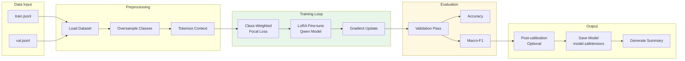

### 2.2 Detailed Training Flow

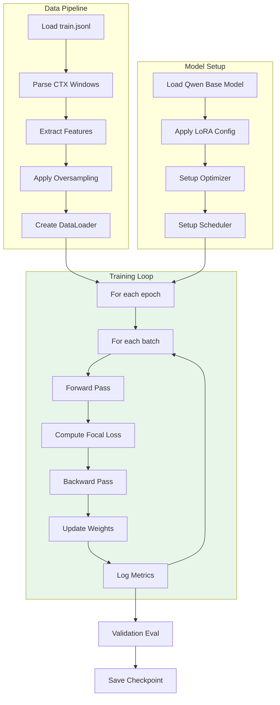

---

## 3. Class Balancing

### 3.1 Oversampling Strategy

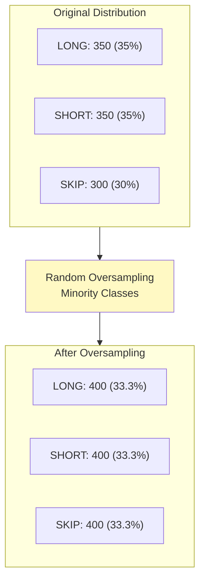

### 3.2 Class Weights Calculation

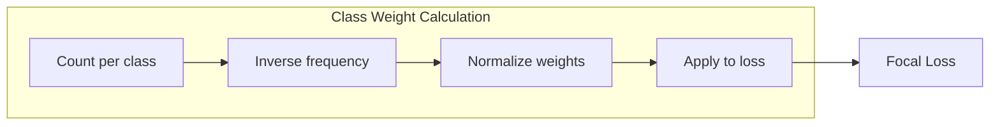

---

## 4. Loss Function

### 4.1 Focal Loss Formula

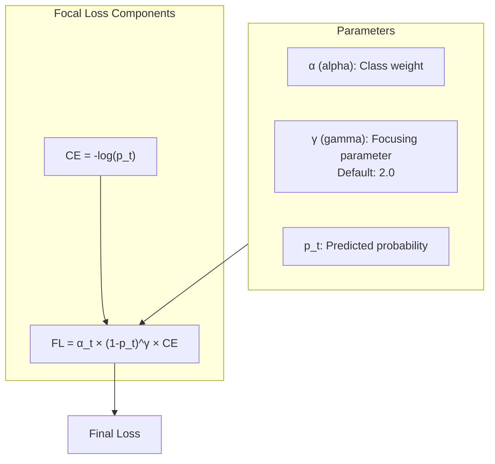

### 4.2 Loss Computation Flow

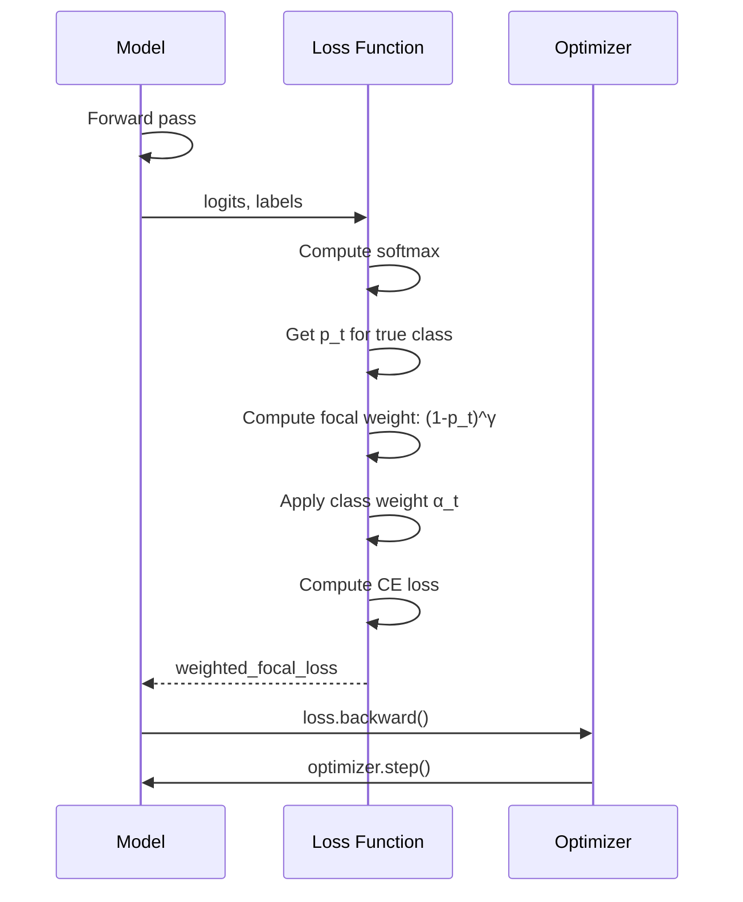

---

## 5. LoRA Configuration

### 5.1 LoRA Architecture

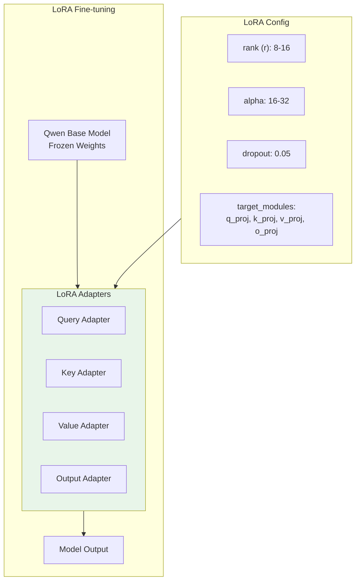

### 5.2 Parameter Efficiency

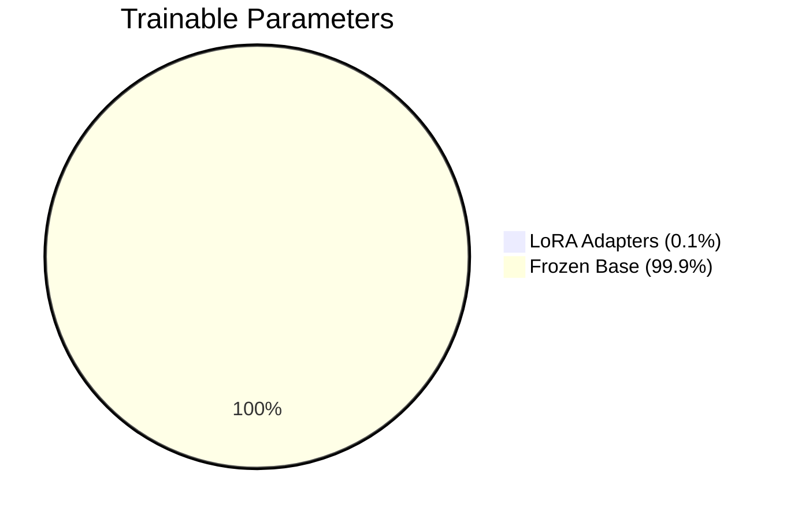

---

## 6. Evaluation Metrics

### 6.1 Metrics Computation

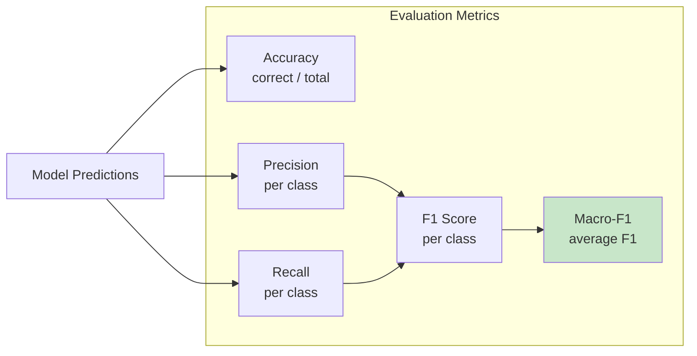

### 6.2 Target Metrics

| Metric | Target | Priority |
|--------|--------|----------|
| Accuracy | >= 65% | HIGH |
| Macro-F1 | >= 0.60 | **CRITICAL** |
| LONG Precision | >= 60% | HIGH |
| SHORT Precision | >= 60% | HIGH |
| LONG Recall | >= 55% | MEDIUM |
| SHORT Recall | >= 55% | MEDIUM |

---

## 7. Training Configuration

### 7.1 Hyperparameters

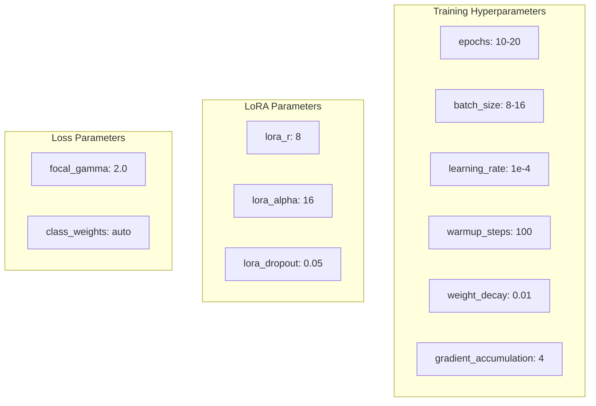

### 7.2 Training Schedule

```mermaid
gantt
    title Training Schedule
    dateFormat X
    axisFormat %s

    section Warmup
    Learning Rate Warmup :0, 100

    section Training
    Epoch 1-5 (High LR)  :100, 500
    Epoch 6-10 (Decay)   :500, 1000

    section Eval
    Validation Each Epoch :active, 0, 1000
```

---

## 8. Checkpointing

### 8.1 Checkpoint Strategy

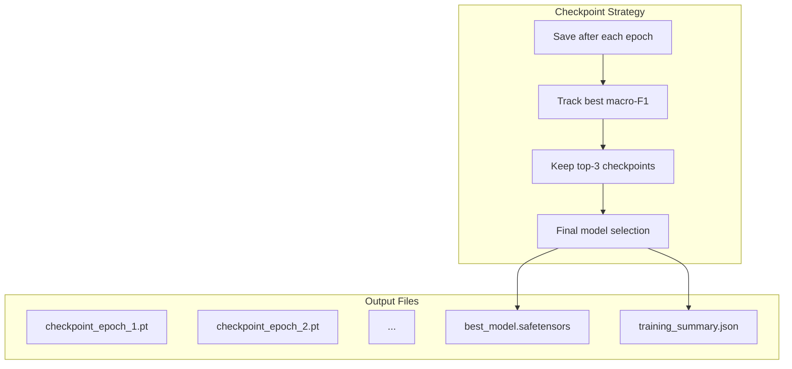

---

## 9. Post-Training

### 9.1 Post-Calibration (Optional)

```mermaid
flowchart LR
    subgraph Calibration["Temperature Scaling"]
        CAL1[Validation predictions]
        CAL2[Learn temperature T]
        CAL3[Apply: p' = softmax(logits/T)]
        CAL4[Better probability estimates]

        CAL1 --> CAL2 --> CAL3 --> CAL4
    end
```

### 9.2 Model Export

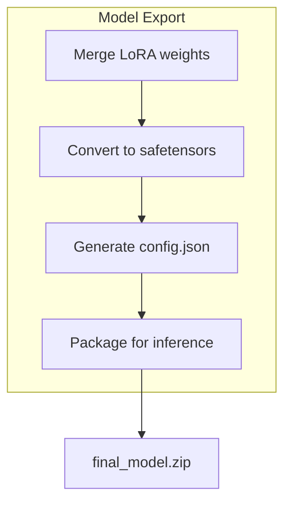

---

## 10. Code Structure

```python
# ml/train.py
class TrainingPipeline:
    def __init__(self, config):
        self.config = config
        self.model = None
        self.optimizer = None
        self.loss_fn = None

    def load_data(self):
        """Load and preprocess train/val datasets"""
        pass

    def setup_model(self):
        """Initialize Qwen + LoRA"""
        pass

    def train_epoch(self):
        """Single training epoch"""
        pass

    def evaluate(self):
        """Validation evaluation"""
        pass

    def save_checkpoint(self):
        """Save model checkpoint"""
        pass

    def run(self):
        """Full training loop"""
        for epoch in range(self.config.epochs):
            self.train_epoch()
            metrics = self.evaluate()
            self.save_checkpoint(metrics)
```

---

## 11. Version History

| Version | Date | Changes |
|---------|------|---------|
| 1.0.0 | 2025-11-24 | Initial Train Loop specification |

---

**Status:** Specification Ready
**Next Steps:** Implement ml/train.py
