# LAYER 4: DEPLOYMENT & INFERENCE

**Version:** 1.0.0
**Date:** November 24, 2025
**Layer:** 4 (Deployment)
**Status:** Specification Ready

---

## 1. Overview

Layer 4 handles model deployment and real-time inference:
- REST API serving the trained model
- Real-time predictions for NinjaTrader
- Trade execution logic
- Performance monitoring

---

## 2. Inference Server Architecture

### 2.1 System Overview

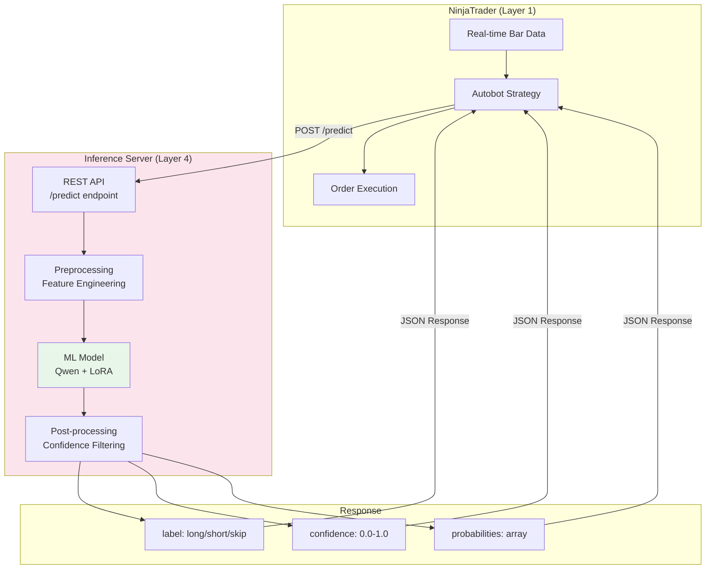

### 2.2 Detailed API Flow

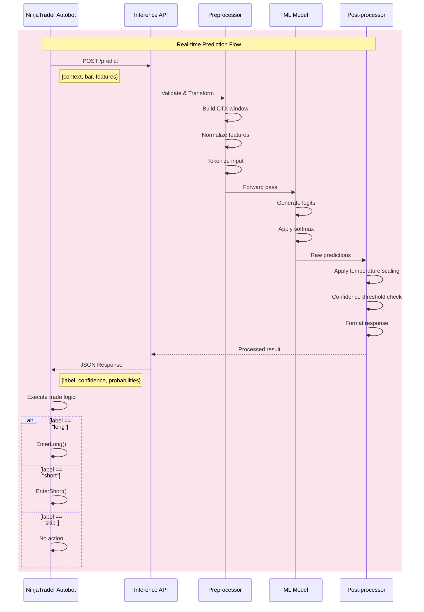

---

## 3. API Specification

### 3.1 Request/Response Flow

```mermaid
flowchart LR
    subgraph Request["POST /predict Request"]
        REQ1[context_bars: array]
        REQ2[current_bar: object]
        REQ3[features: object]
        REQ4[metadata: object]
    end

    subgraph Processing["Server Processing"]
        P1[Validate JSON]
        P2[Build CTX window]
        P3[Model inference]
        P4[Format response]
    end

    subgraph Response["Response JSON"]
        RES1[label: string]
        RES2[confidence: float]
        RES3[probabilities: object]
        RES4[processing_time_ms: int]
    end

    Request --> P1 --> P2 --> P3 --> P4 --> Response
```

### 3.2 Request Schema

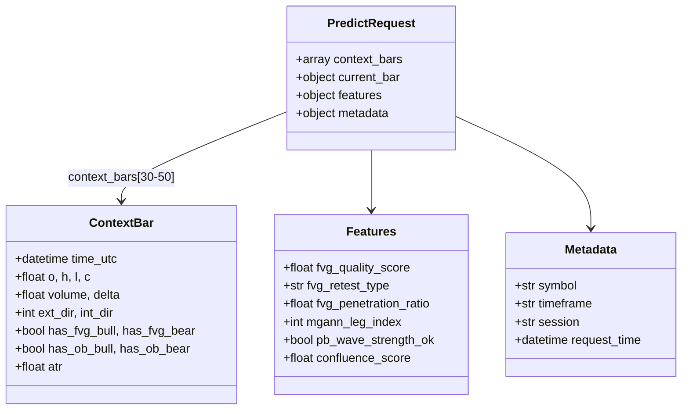

### 3.3 Response Schema

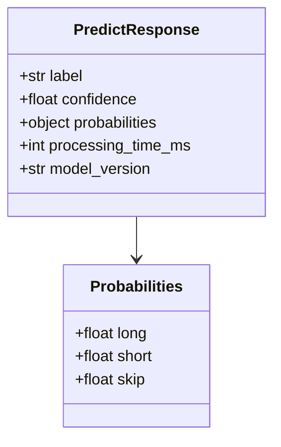

---

## 4. Trade Execution Logic

### 4.1 NinjaTrader Autobot Flow

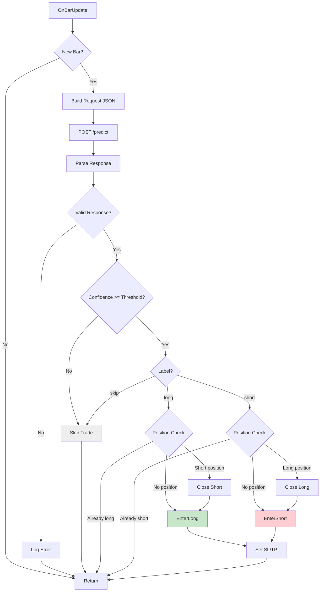

### 4.2 Confidence Threshold Logic

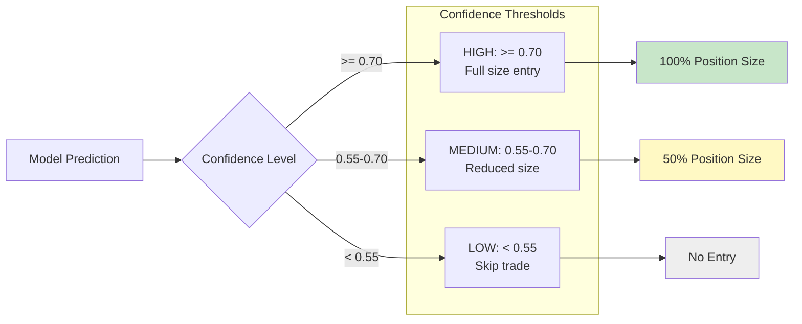

---

## 5. Server Implementation

### 5.1 Component Architecture

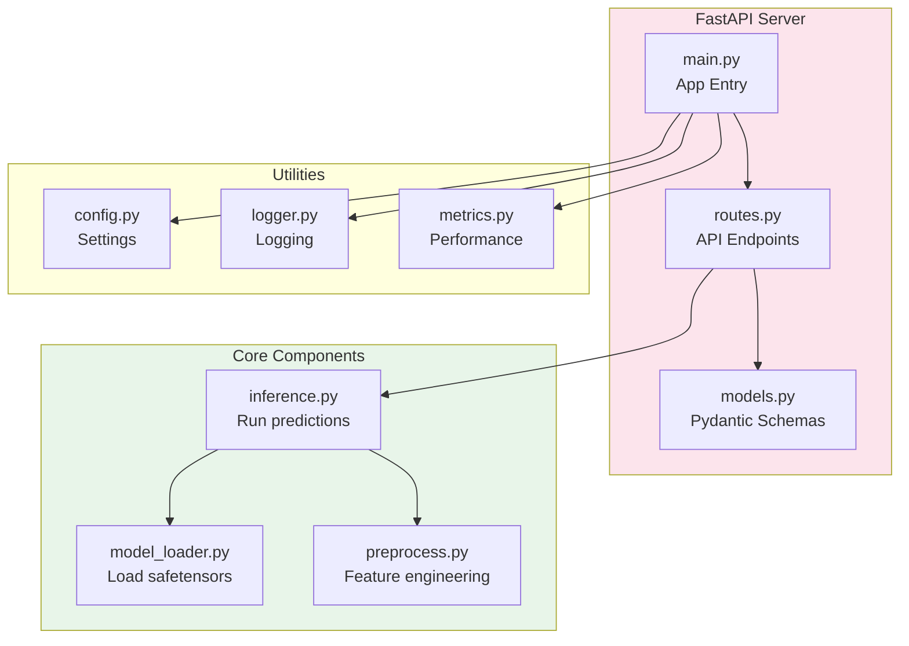

### 5.2 Request Processing Pipeline

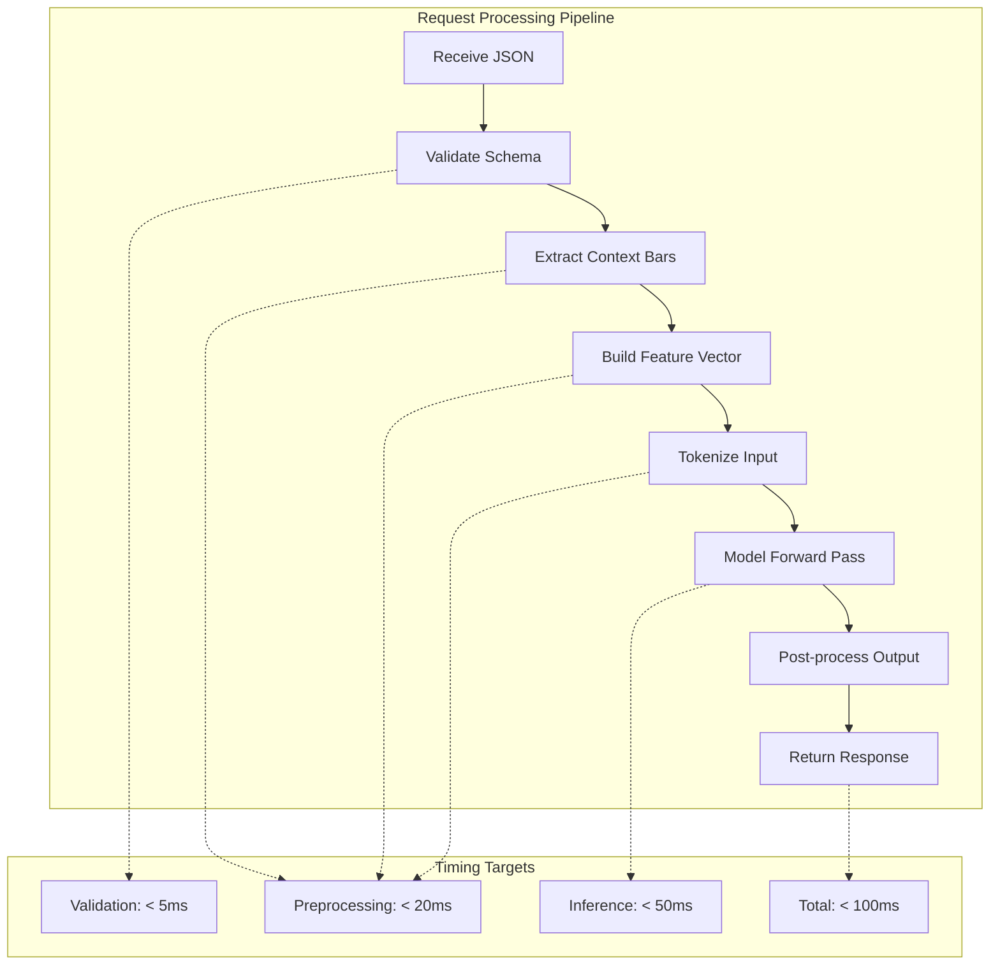

---

## 6. Error Handling

### 6.1 Error Response Flow

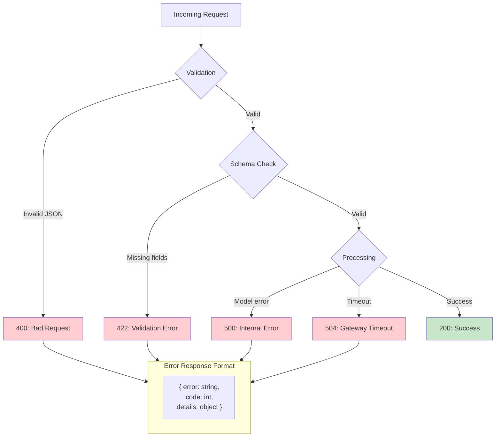

### 6.2 Retry Logic (Client Side)

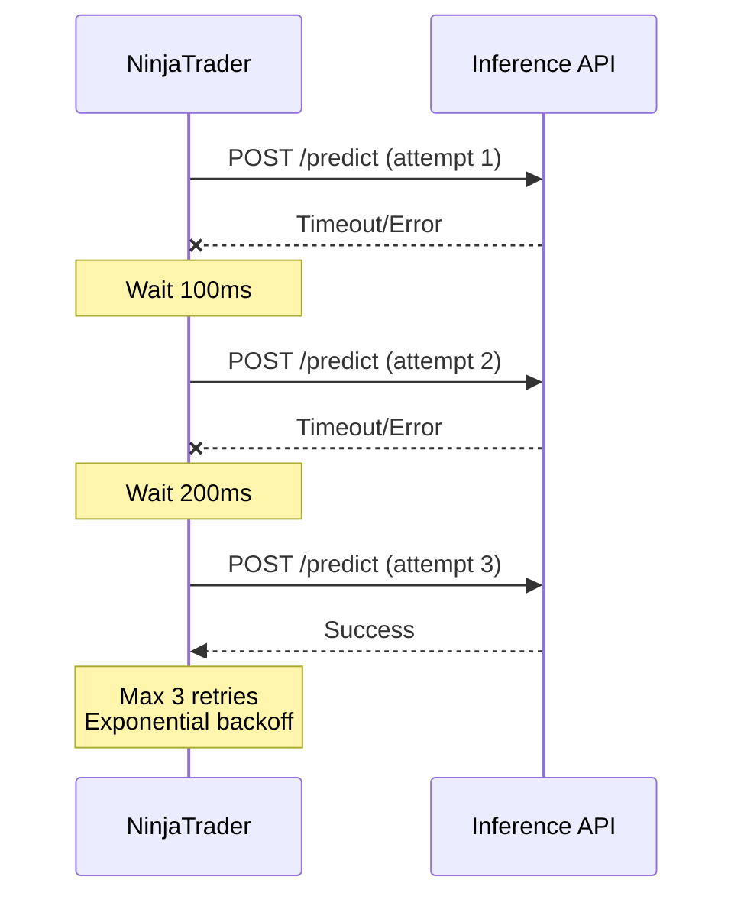

---

## 7. Monitoring & Metrics

### 7.1 Metrics Dashboard

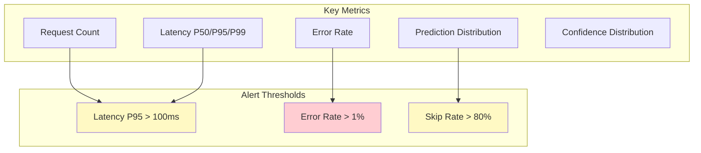

### 7.2 Logging Structure

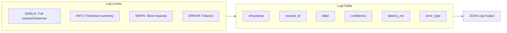

---

## 8. Deployment Configuration

### 8.1 Production Setup

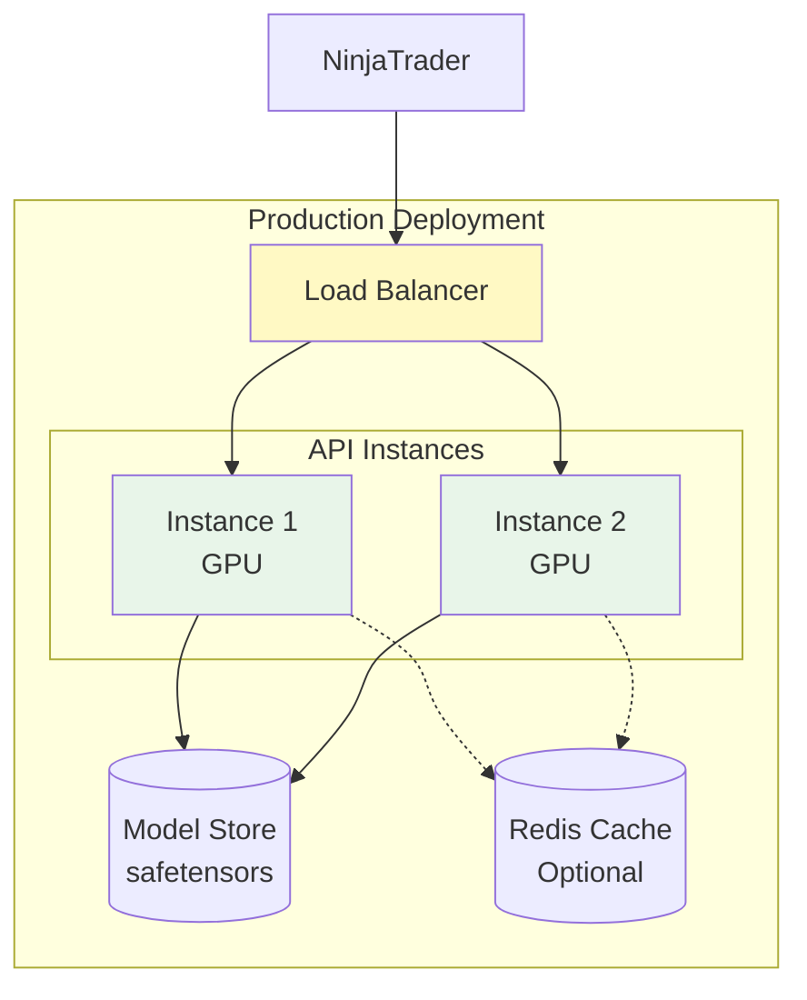

### 8.2 Environment Configuration

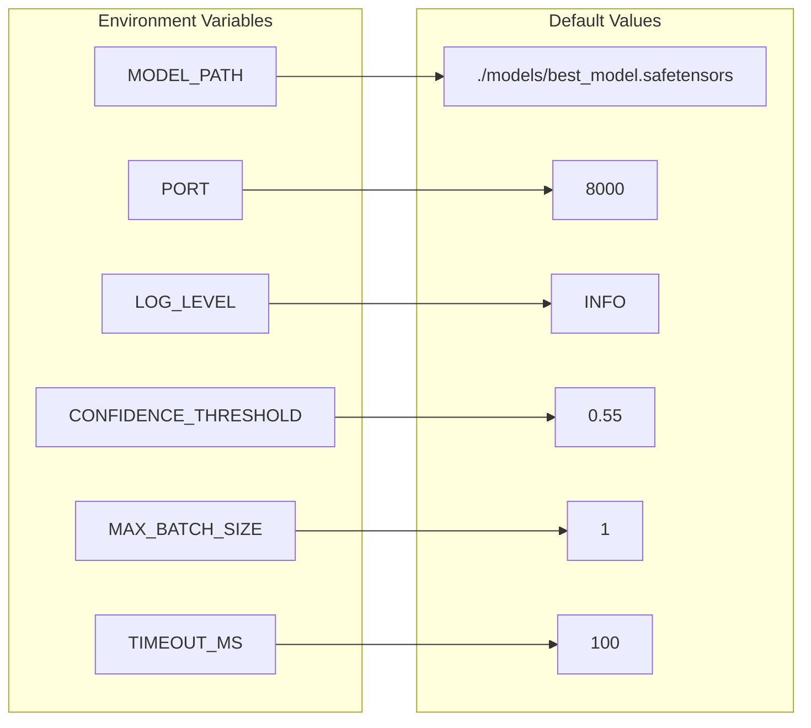

---

## 9. Code Structure

```python
# api/server.py
from fastapi import FastAPI, HTTPException
from pydantic import BaseModel
import torch

app = FastAPI(title="SMC ML Inference API")

class PredictRequest(BaseModel):
    context_bars: list[dict]
    current_bar: dict
    features: dict
    metadata: dict | None = None

class PredictResponse(BaseModel):
    label: str
    confidence: float
    probabilities: dict
    processing_time_ms: int

@app.post("/predict", response_model=PredictResponse)
async def predict(request: PredictRequest):
    """Run inference on trading signal"""
    start = time.time()

    # Preprocess
    features = preprocess(request)

    # Inference
    with torch.no_grad():
        logits = model(features)
        probs = torch.softmax(logits, dim=-1)

    # Post-process
    label_idx = probs.argmax().item()
    label = ["long", "short", "skip"][label_idx]
    confidence = probs[label_idx].item()

    return PredictResponse(
        label=label,
        confidence=confidence,
        probabilities={
            "long": probs[0].item(),
            "short": probs[1].item(),
            "skip": probs[2].item(),
        },
        processing_time_ms=int((time.time() - start) * 1000)
    )

@app.get("/health")
async def health():
    """Health check endpoint"""
    return {"status": "healthy", "model_loaded": model is not None}
```

---

## 10. Version History

| Version | Date | Changes |
|---------|------|---------|
| 1.0.0 | 2025-11-24 | Initial Deployment & Inference specification |

---

**Status:** Specification Ready
**Next Steps:** Implement api/server.py, api/predict.py
