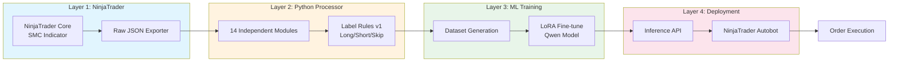
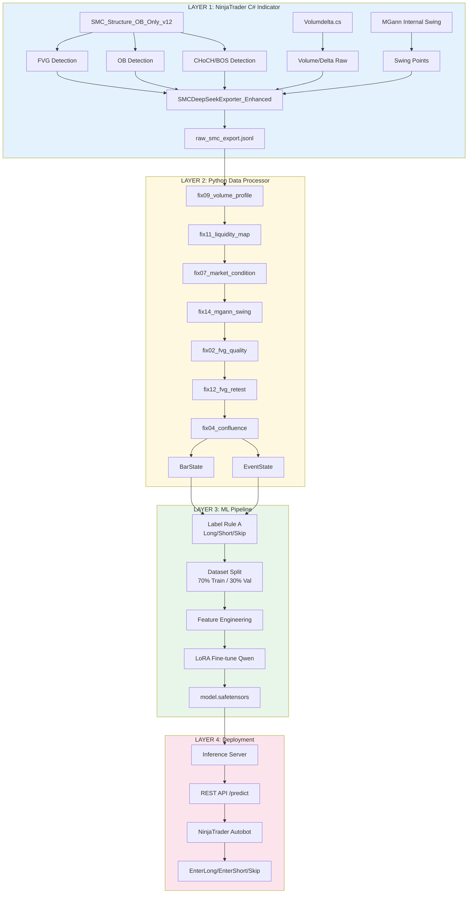
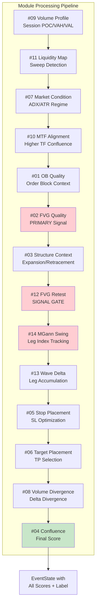
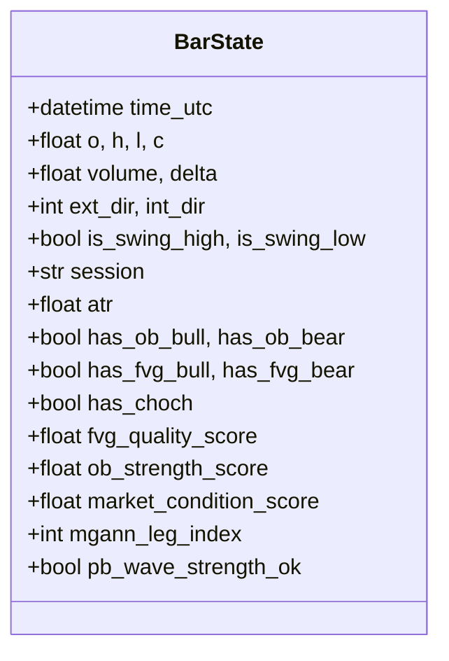
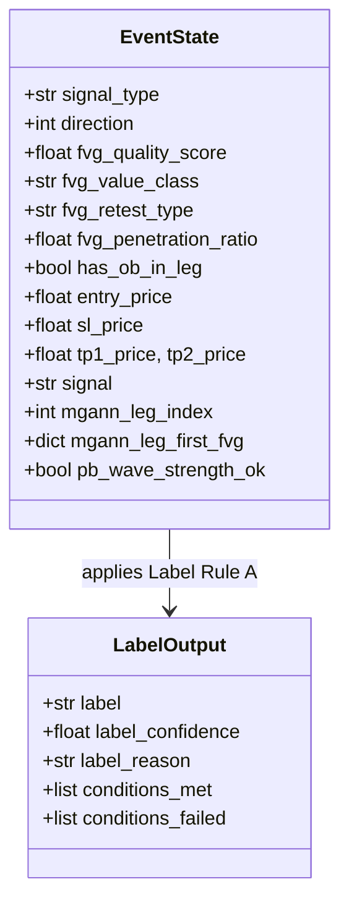
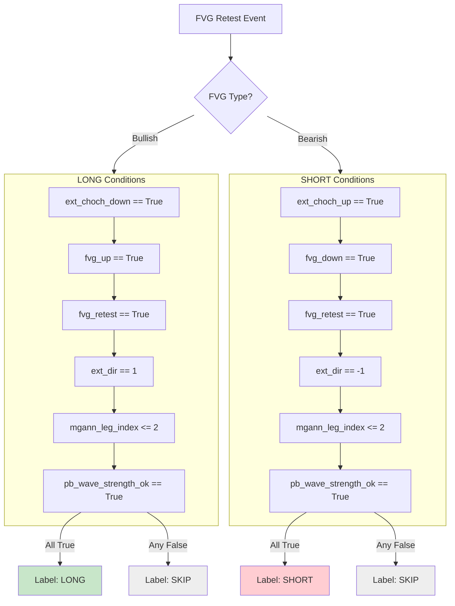
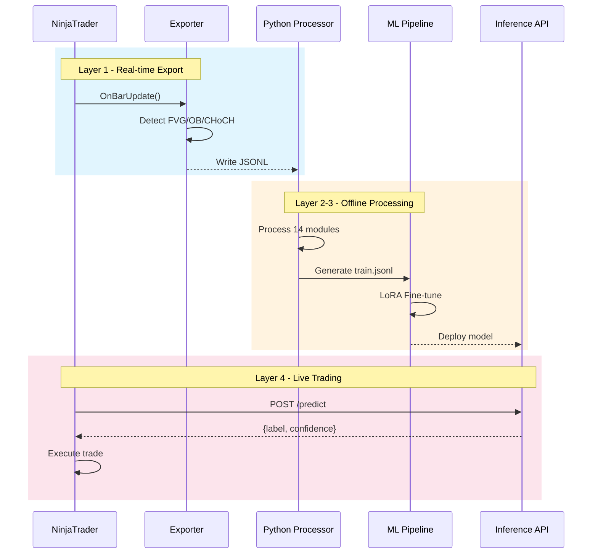

# PROJECT ARCHITECTURE V3 - System Overview

**Version:** 3.0.0
**Date:** November 24, 2025
**Status:** Production Ready

---

## 1. System Architecture Overview

### 1.1 Complete Data Flow Diagram



### 1.2 Detailed Layer Architecture



---

## 2. Module Pipeline Flow

### 2.1 Layer 2 Processing Order



---

## 3. Data Structures

### 3.1 BarState Schema



### 3.2 EventState Schema



---

## 4. Key Components

### 4.1 Label Rule (A) Decision Flow



---

## 5. Integration Points

### 5.1 NinjaTrader ↔ Python Integration



---

## 6. File Structure

```
plantrainAI/
├── ARCHITECTURE_V3.md              # Master architecture document
├── README.md                       # Project overview
│
├── indicators/                     # Layer 1: NinjaTrader C#
│   ├── SMCDeepSeekExporter_Enhanced.cs
│   ├── SMC_Structure_OB_Only_v12_FVG_CHOCHFlags_DeepSeek.cs
│   └── Volumdelta.cs
│
├── processor/                      # Layer 2: Python Processor
│   ├── core/
│   │   ├── bar_state.py
│   │   ├── event_state.py
│   │   └── module_base.py
│   ├── modules/                    # 14 Independent Modules
│   │   ├── fix01_ob_quality.py
│   │   ├── fix02_fvg_quality.py
│   │   ├── ...
│   │   └── fix14_mgann_swing.py
│   ├── backtest/
│   └── validation/
│
├── ml/                             # Layer 3: ML Pipeline (future)
│   ├── train.py
│   ├── dataset.py
│   └── models/
│
├── api/                            # Layer 4: Inference (future)
│   ├── server.py
│   └── predict.py
│
└── docs/                           # Documentation
    ├── Project_Architecture_v3.md  # This file
    ├── SMC_Strategy_Long_v1.md
    ├── SMC_Strategy_Short_v1.md
    ├── LAYER2_Label_Rules_v1.md
    ├── CTX_V3_Schema.md
    ├── LAYER3_TRAIN_LOOP.md
    └── LAYER4_DEPLOY_INFER.md
```

---

## 7. Version History

| Version | Date | Changes |
|---------|------|---------|
| 3.0.0 | 2025-11-24 | Complete Mermaid diagrams, Layer Architecture V3 |
| 2.1.0 | 2025-11-21 | FVG Quality v2.0, Wave Delta module |
| 2.0.0 | 2025-11-20 | 14 module architecture |

---

**Status:** Production Ready
**Next Steps:** Implement Layer 3 (ML Pipeline) and Layer 4 (Inference API)
