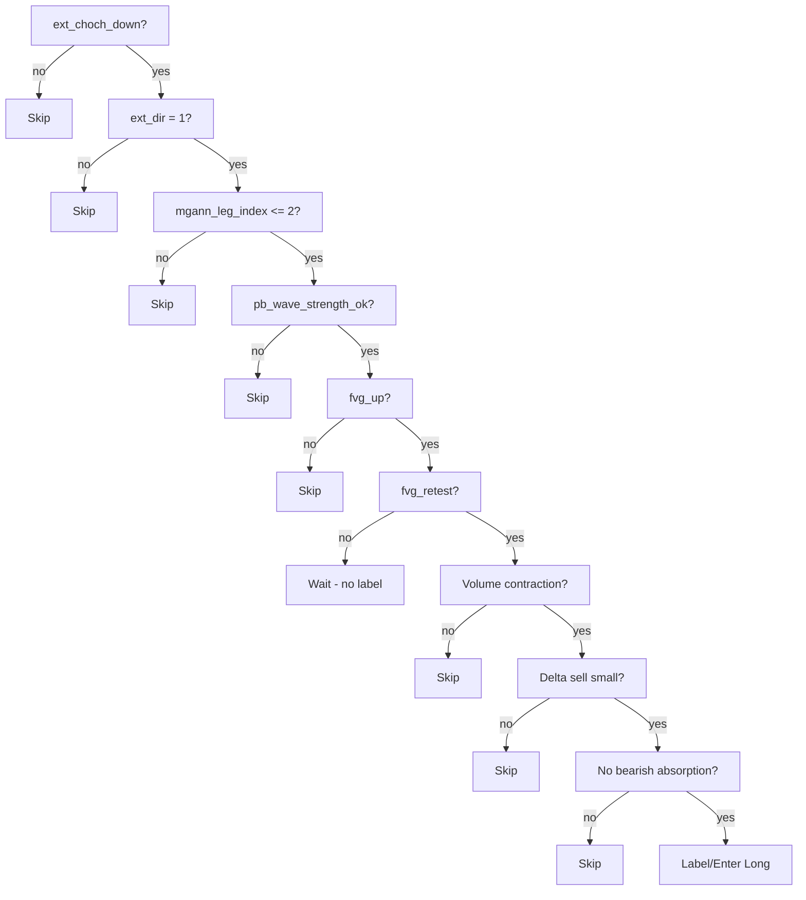

# SMC Strategy Long v1.0

Canonical long entry flow: **External CHoCH Down → Reclaim → MGann leg → FVG up → Retest → Pullback OK → Long**. Case A (Leg1 FVG) and Case B (Leg2 FVG) are unified into one rule.

## Required exporter fields
- `ext_choch_down`
- `fvg_up`
- `fvg_retest`
- `ext_dir`
- `mgann_leg_index`
- `pb_wave_strength_ok`
- Optional soft feature: `mgann_leg_first_fvg`

## Volume/Delta guardrails
- **Delta sell small** on retest (no aggressive selling).
- **Volume contraction** on retest vs. creation bar.
- **No bearish absorption** detected on retest candle.
- If any guardrail fails → treat as `skip`.

## Unified logic (Case A/B merged)
- `ext_choch_down = true`
- `ext_dir = 1`
- `mgann_leg_index <= 2`
- `fvg_up = true`
- `fvg_retest = true`
- `pb_wave_strength_ok = true`
- → Action: Long entry allowed (prefers `mgann_leg_first_fvg = true`).

## Flowchart (Mermaid)

## Version
- **v1.0** — unified long strategy aligned to architecture v3.
