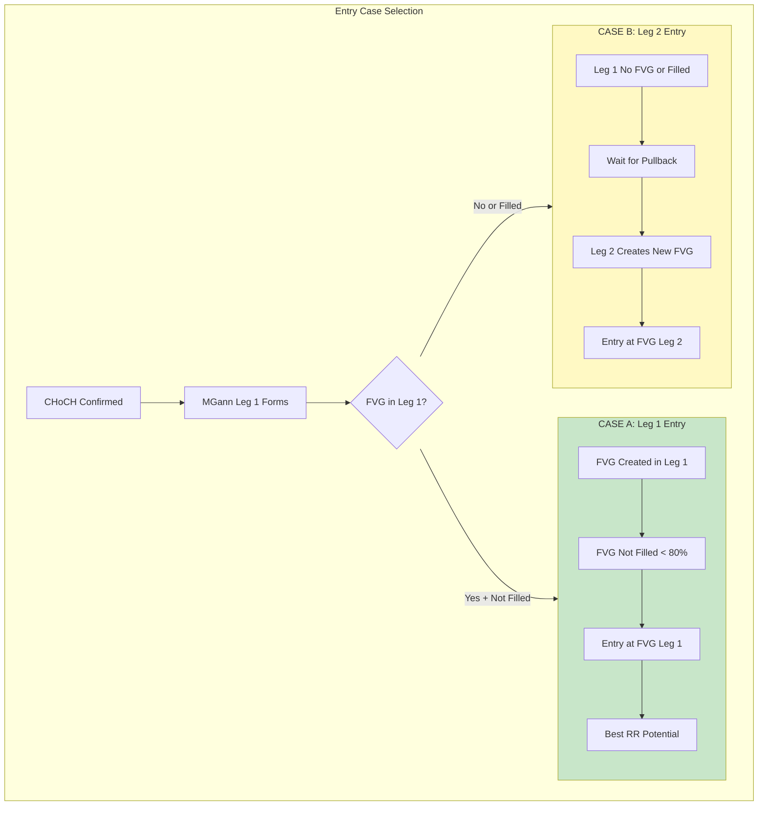
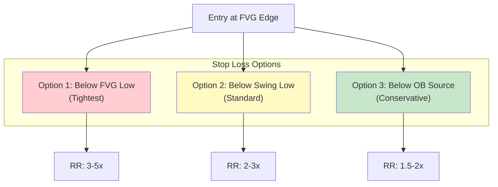

# SMC LONG STRATEGY V1

**Version:** 1.0.0
**Date:** November 24, 2025
**Strategy Type:** Long (Bullish)
**Status:** Production Ready

---

## 1. Strategy Overview

### 1.1 Core Concept

The SMC Long Strategy identifies high-probability long entries using:
- External CHoCH Down (reversal signal)
- MGann Swing Leg tracking (entry timing)
- FVG Retest (entry zone)
- Pullback Wave Strength (confirmation)

---

## 2. Strategy Flow Diagram

### 2.1 Main Entry Flow

```mermaid
flowchart TD
    subgraph Phase1["PHASE 1: Structure Break"]
        A[Price in Downtrend] --> B[External CHoCH DOWN<br/>ext_choch_down = True]
        B --> C[Structure Break Confirmed]
    end

    subgraph Phase2["PHASE 2: Reclaim"]
        C --> D[Price Reclaims Back<br/>into Previous Range]
        D --> E[ext_dir = 1<br/>Uptrend Confirmed]
    end

    subgraph Phase3["PHASE 3: MGann Leg Formation"]
        E --> F[MGann Swing Leg 1 UP]
        F --> G{FVG Created<br/>in Leg 1?}
    end

    subgraph Phase4["PHASE 4: Entry Decision"]
        G -->|Yes| H[Case A: FVG Leg 1<br/>mgann_leg_index = 1]
        G -->|No/Filled| I[Wait for Leg 2]
        I --> J[Case B: FVG Leg 2<br/>mgann_leg_index = 2]
        H --> K[Wait for FVG Retest]
        J --> K
    end

    subgraph Phase5["PHASE 5: Confirmation"]
        K --> L{FVG Retest<br/>fvg_retest = True?}
        L -->|Yes| M{Pullback Wave<br/>Strength OK?}
        L -->|No| N[Continue Waiting]
        M -->|Yes| O[✅ ENTRY LONG]
        M -->|No| P[❌ SKIP]
    end

    style A fill:#ffcdd2
    style B fill:#fff9c4
    style E fill:#c8e6c9
    style O fill:#81c784
    style P fill:#ef9a9a
```



### 2.2 Detailed Price Action Flow

```mermaid
flowchart LR
    subgraph PriceAction["Price Action Sequence"]
        direction TB
        PA1["📉 Downtrend"]
        PA2["🔄 CHoCH Down<br/>(Break of Structure)"]
        PA3["📈 Reclaim UP"]
        PA4["⬆️ Leg 1 Impulse<br/>(Creates FVG)"]
        PA5["⬇️ Pullback<br/>(Weak Delta)"]
        PA6["🎯 FVG Retest"]
        PA7["✅ LONG Entry"]

        PA1 --> PA2 --> PA3 --> PA4 --> PA5 --> PA6 --> PA7
    end
```



---

## 3. Entry Conditions

### 3.1 All Required Conditions

```mermaid
flowchart TD
    START[FVG Retest Event Detected] --> C1

    C1{ext_choch_down<br/>== True?}
    C1 -->|Yes| C2
    C1 -->|No| SKIP1[SKIP: No CHoCH]

    C2{fvg_up<br/>== True?}
    C2 -->|Yes| C3
    C2 -->|No| SKIP2[SKIP: No Bullish FVG]

    C3{fvg_retest<br/>== True?}
    C3 -->|Yes| C4
    C3 -->|No| SKIP3[SKIP: No Retest]

    C4{ext_dir<br/>== 1?}
    C4 -->|Yes| C5
    C4 -->|No| SKIP4[SKIP: Wrong Direction]

    C5{mgann_leg_index<br/><= 2?}
    C5 -->|Yes| C6
    C5 -->|No| SKIP5[SKIP: Late Entry]

    C6{pb_wave_strength_ok<br/>== True?}
    C6 -->|Yes| LONG[✅ LONG ENTRY]
    C6 -->|No| SKIP6[SKIP: Weak Pullback]

    style LONG fill:#81c784,stroke:#2e7d32
    style SKIP1 fill:#ef9a9a
    style SKIP2 fill:#ef9a9a
    style SKIP3 fill:#ef9a9a
    style SKIP4 fill:#ef9a9a
    style SKIP5 fill:#ef9a9a
    style SKIP6 fill:#ef9a9a
```



### 3.2 Conditions Summary Table

| # | Condition | Field | Value | Purpose |
|---|-----------|-------|-------|---------|
| 1 | CHoCH Down | `ext_choch_down` | `True` | Reversal signal |
| 2 | Bullish FVG | `fvg_up` | `True` | Entry zone exists |
| 3 | FVG Retest | `fvg_retest` | `True` | Price tested zone |
| 4 | Uptrend | `ext_dir` | `1` | Aligned direction |
| 5 | Early Leg | `mgann_leg_index` | `<= 2` | Better RR |
| 6 | PB Weak | `pb_wave_strength_ok` | `True` | Exhaustion confirmed |

---

## 4. Case A vs Case B Entry

### 4.1 Entry Case Decision



### 4.2 Visual Price Action

```
CASE A (Best Scenario):
                    ┌─── Leg 1 High
                   /│
                  / │
                 /  │
                /───┤ ← FVG Zone (Entry)
               /    │
    CHoCH ────┘     │
                    └─── Stop Loss

CASE B (Fallback):
                         ┌─── Leg 2 High
                        /│
                       / │
           ┌─── Leg 1 /──┤ ← FVG Zone (Entry)
          /│        /    │
         / │(filled)/    │
    CHoCH──┘       │     │
                   └─────┘
```

---

## 5. Risk Management

### 5.1 Stop Loss Placement



### 5.2 Target Placement

| Target | Description | RR |
|--------|-------------|-----|
| TP1 | Nearest structure high | 1:1 - 1.5:1 |
| TP2 | Previous swing high | 2:1 - 3:1 |
| TP3 | Liquidity above | 3:1+ |

---

## 6. Validation Metrics

### 6.1 Expected Performance

| Metric | Target | Notes |
|--------|--------|-------|
| Win Rate | >= 40% | After all filters |
| Average RR | >= 2.0 | Risk-adjusted |
| Profit Factor | >= 1.5 | Gross profit / Gross loss |
| Max Drawdown | <= 15% | Risk management |

### 6.2 Correlation with Label Rule (A)

```python
# Label Rule (A) - LONG
def is_valid_long(event):
    return all([
        event.ext_choch_down == True,
        event.fvg_up == True,
        event.fvg_retest == True,
        event.ext_dir == 1,
        event.mgann_leg_index <= 2,
        event.pb_wave_strength_ok == True,
    ])
```

---

## 7. Version History

| Version | Date | Changes |
|---------|------|---------|
| 1.0.0 | 2025-11-24 | Initial SMC Long Strategy with Mermaid diagrams |

---

**Status:** Production Ready
**Related:** [Label Rules](LABEL_RULES.md), [MGann Swing](MODULE_FIX14_MGANN_SWING.md)
