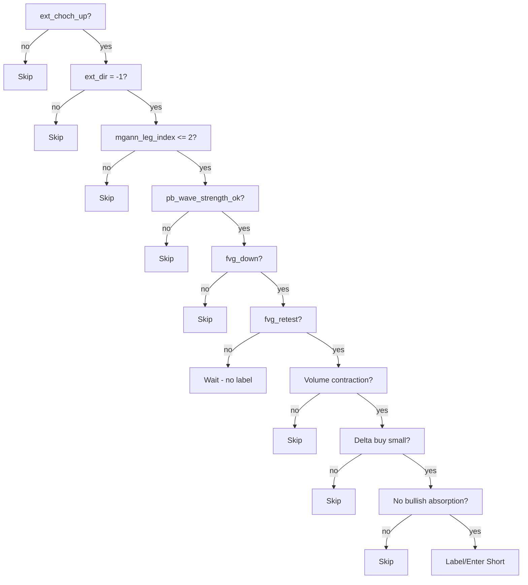

# SMC Strategy Short v1.0

Canonical short entry flow: **External CHoCH Up → Reclaim down → MGann leg down → FVG down → Retest → Pullback OK → Short**. Case A (Leg1 FVG) and Case B (Leg2 FVG) are unified.

## Required exporter fields
- `ext_choch_up`
- `fvg_down`
- `fvg_retest`
- `ext_dir = -1`
- `mgann_leg_index`
- `pb_wave_strength_ok`
- Optional soft feature: `mgann_leg_first_fvg`

## Volume/Delta guardrails
- **Delta buy small** on retest (no aggressive buying).
- **Volume contraction** on retest vs. creation bar.
- **No bullish absorption** on retest.
- Failing any guardrail → `skip`.

## Unified logic (Case A/B merged)
- `ext_choch_up = true`
- `ext_dir = -1`
- `mgann_leg_index <= 2`
- `fvg_down = true`
- `fvg_retest = true`
- `pb_wave_strength_ok = true`
- → Action: Short entry allowed (prefer `mgann_leg_first_fvg = true`).

## Flowchart (Mermaid)

## Version
- **v1.0** — unified short strategy aligned to architecture v3.
