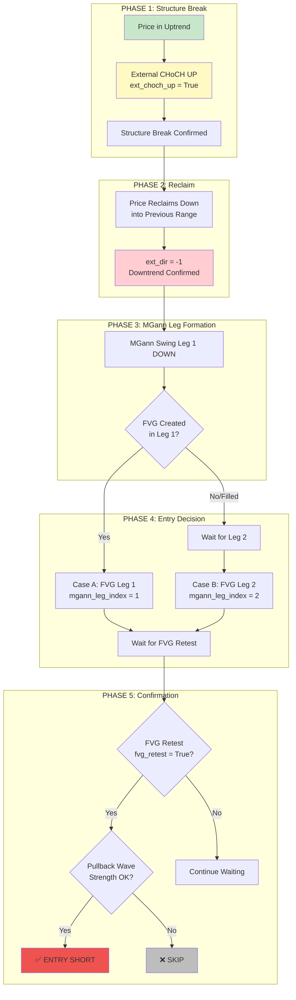
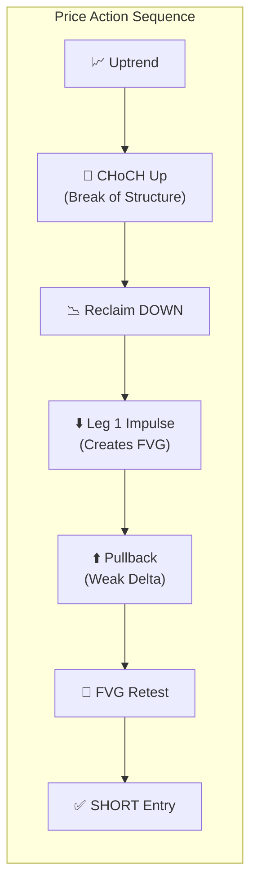
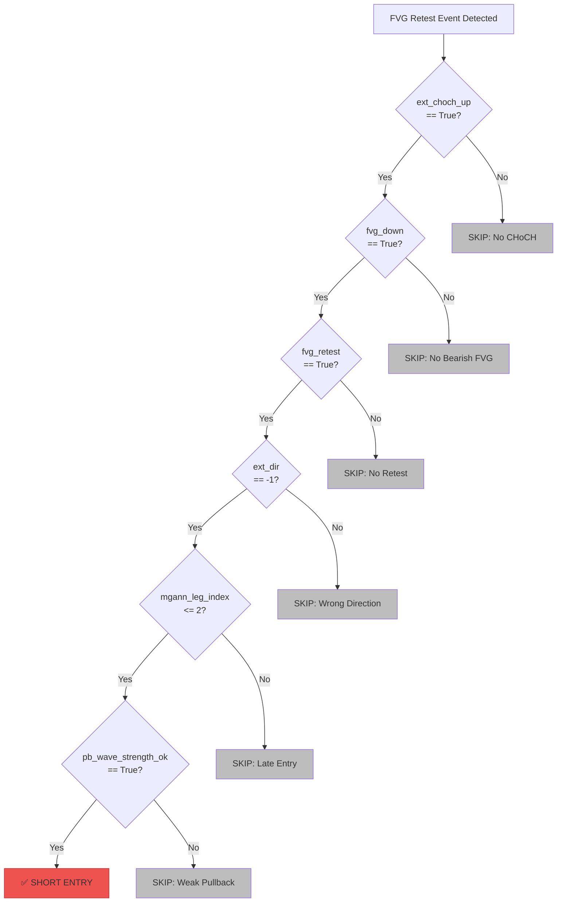
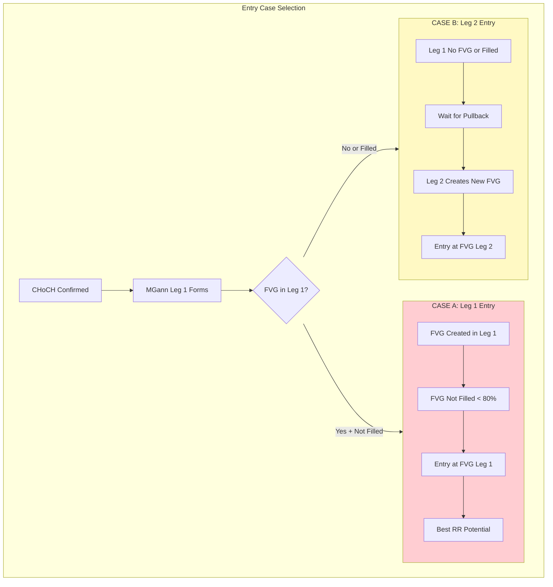
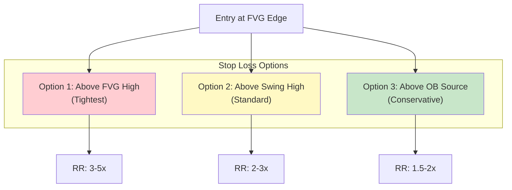
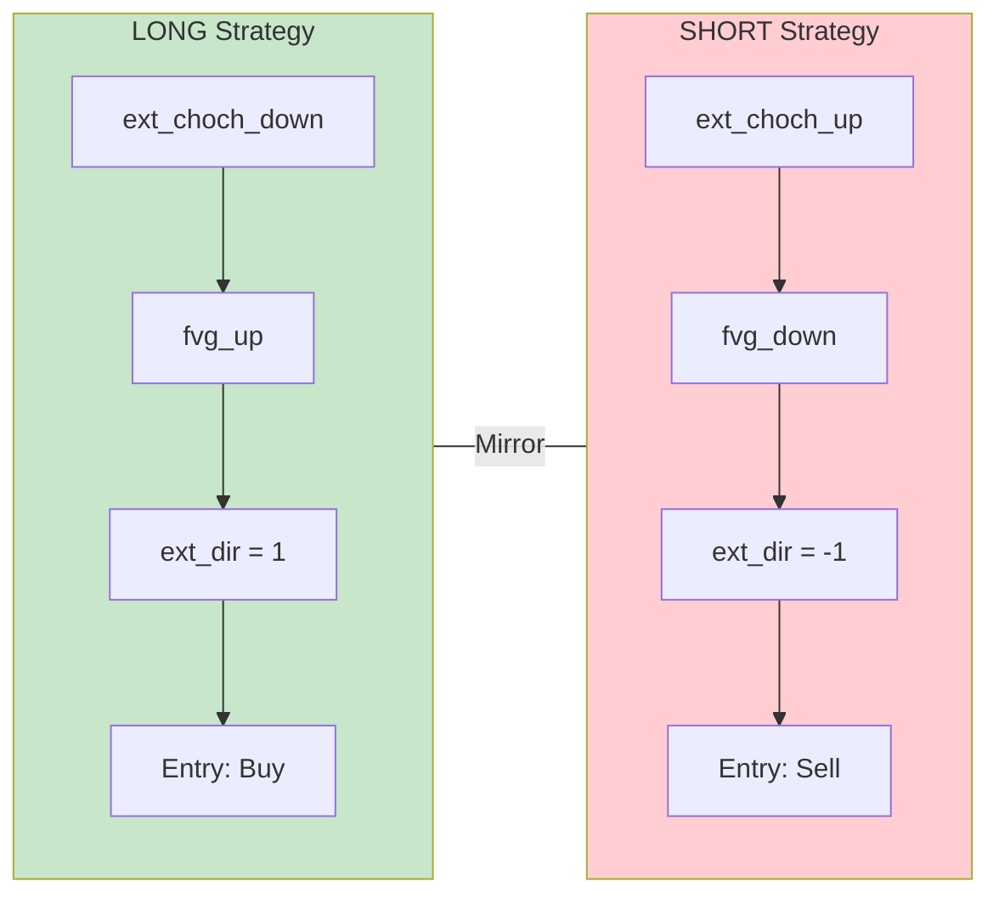

# SMC SHORT STRATEGY V1

**Version:** 1.0.0
**Date:** November 24, 2025
**Strategy Type:** Short (Bearish)
**Status:** Production Ready

---

## 1. Strategy Overview

### 1.1 Core Concept

The SMC Short Strategy identifies high-probability short entries using:
- External CHoCH Up (reversal signal from bullish)
- MGann Swing Leg tracking (entry timing)
- FVG Retest (entry zone - bearish)
- Pullback Wave Strength (confirmation)

---

## 2. Strategy Flow Diagram

### 2.1 Main Entry Flow



### 2.2 Detailed Price Action Flow



---

## 3. Entry Conditions

### 3.1 All Required Conditions



### 3.2 Conditions Summary Table

| # | Condition | Field | Value | Purpose |
|---|-----------|-------|-------|---------|
| 1 | CHoCH Up | `ext_choch_up` | `True` | Reversal signal |
| 2 | Bearish FVG | `fvg_down` | `True` | Entry zone exists |
| 3 | FVG Retest | `fvg_retest` | `True` | Price tested zone |
| 4 | Downtrend | `ext_dir` | `-1` | Aligned direction |
| 5 | Early Leg | `mgann_leg_index` | `<= 2` | Better RR |
| 6 | PB Weak | `pb_wave_strength_ok` | `True` | Exhaustion confirmed |

---

## 4. Case A vs Case B Entry

### 4.1 Entry Case Decision



### 4.2 Visual Price Action

```
CASE A (Best Scenario):
    CHoCH ────┐
               \    │
                \───┤ ← FVG Zone (Entry)
                 \  │
                  \ │
                   \│
                    └─── Leg 1 Low
                         Stop Loss Above

CASE B (Fallback):
    CHoCH──┐       ┌─────┐
           │      /      │
           \│(filled)    │
            └─── Leg 1  /──┤ ← FVG Zone (Entry)
                       /   │
                      /    │
                     └─── Leg 2 Low
```

---

## 5. Risk Management

### 5.1 Stop Loss Placement



### 5.2 Target Placement

| Target | Description | RR |
|--------|-------------|-----|
| TP1 | Nearest structure low | 1:1 - 1.5:1 |
| TP2 | Previous swing low | 2:1 - 3:1 |
| TP3 | Liquidity below | 3:1+ |

---

## 6. Long vs Short Comparison



---

## 7. Validation Metrics

### 7.1 Expected Performance

| Metric | Target | Notes |
|--------|--------|-------|
| Win Rate | >= 40% | After all filters |
| Average RR | >= 2.0 | Risk-adjusted |
| Profit Factor | >= 1.5 | Gross profit / Gross loss |
| Max Drawdown | <= 15% | Risk management |

### 7.2 Correlation with Label Rule (A)

```python
# Label Rule (A) - SHORT
def is_valid_short(event):
    return all([
        event.ext_choch_up == True,
        event.fvg_down == True,
        event.fvg_retest == True,
        event.ext_dir == -1,
        event.mgann_leg_index <= 2,
        event.pb_wave_strength_ok == True,
    ])
```

---

## 8. Version History

| Version | Date | Changes |
|---------|------|---------|
| 1.0.0 | 2025-11-24 | Initial SMC Short Strategy with Mermaid diagrams |

---

**Status:** Production Ready
**Related:** [Label Rules](LABEL_RULES.md), [MGann Swing](MODULE_FIX14_MGANN_SWING.md)
